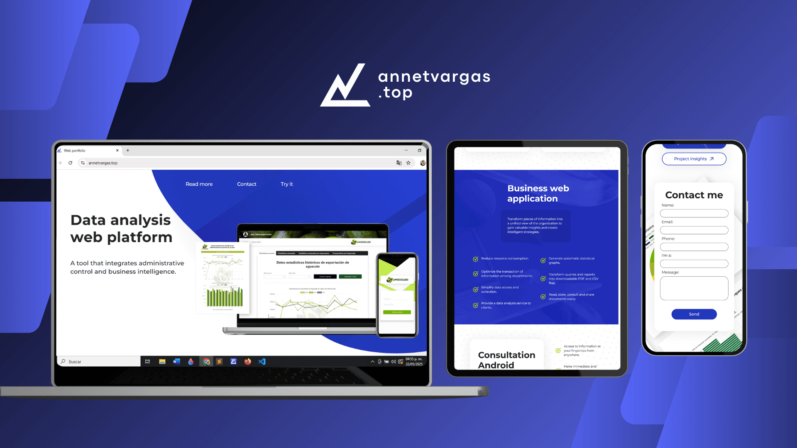
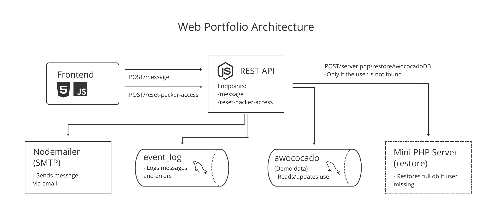

# 🌐 Web Portfolio – [annetvargas.top](https://annetvargas.top)



This repository contains the source code of my personal web portfolio, a project developed consistently between late 2023 and early 2025. It was conceived not only as a platform to showcase my work but also as an opportunity to deepen my understanding of core web development principles, explore new technologies, and refine my technical and creative skills.



The system architecture shown above reflects the flow between the frontend server hosted on Hostinger, which includes the MySQL databases and the PHP fallback server, the backend API running on Render, and external SMTP services used for notifications.<br><br>

## 🧩 Project Overview

### Frontend  
Built with HTML5, CSS3, and decoupled JavaScript, following a modular, well-structured approach.

### Backend  
Powered by Node.js and Express, containerized with Docker, and exposed through a REST API.<br><br>

Throughout development, I focused on:<br>

- Clear separation of concerns and structural best practices.
- Accessibility and search engine optimization (SEO).
- Responsive design and performance optimization.
- User experience and interface refinement.
- Deployment architecture using Docker.<br><br>

## 🎯 Project Motivation and Learning Goals

This portfolio is not only a showcase of my work but also a tool I used to:

- Learn Node.js and REST API development.
- Strengthen my knowledge of Docker.
- Improve my frontend architecture with clean, maintainable JavaScript and CSS3.
- Deepen my understanding of accessibility and SEO.
- Gain hands-on experience designing responsive, user-centered interfaces.

Due to time constraints during previous professional projects, I wasn't able to explore new technologies or structure applications in the way I envisioned. With this project, I set out to resolve every technical doubt at my own pace.<br><br>

## 🧠 Technology Decisions and React Context

At the time I built this project, I had already taken a React-oriented approach to frontend development and applied it in several study projects. However, one of the first things I learned when studying it was to understand when to use it: when it's a powerful tool, when it can hurt performance, and when it might not be helpful at all.

I've always approached development with a software engineering mindset, and I wanted this project to reflect not only my technical skills, but also my theoretical understanding, experience, and ability to make thoughtful design decisions. If another developer asked why I followed this approach, I would respond that I evaluated the project's needs and decided that vanilla JavaScript was the best fit for an application with limited interactivity.

While working on this web portfolio, I focused on experimenting with how far I could push JavaScript for UI behavior and dynamic styling without compromising performance, alongside using server-side rendering for responsive interface design. I still believe the approach I took was appropriate. That said, I do regret not taking the opportunity to gain more experience with React. I’m looking forward to adding React practice projects to my GitHub soon.<br><br>

## 🛠️ Notable Features and Technical Structure

### 🧱 Frontend

- Folder-structured JavaScript, CSS, and HTML files with matching names (e.g., `index.js` and `index.html`).
- Resources include compressed graphics for different screen widths (below/above 887px).
- I reused some Bootstrap libraries in the `libraries/` folder, which I had previously downloaded when developing the demo during my earlier learning stages (before I was familiar with best development practices), due to issues with a library's CDN. This was done to ensure consistency and leverage existing local assets from the demo setup, while still incorporating modern package management tools like npm and composer, which I also used in this project and you can review in the repository.<br><br>

### 🔄 Dynamic Content and PHP Integration

I integrated a minimal PHP server script in the `core/` folder to handle database restoration **only in cases where the user table was manually cleared or altered by me**, which is not possible under normal usage. 

This setup was part of my experimentation and curiosity about dealing with database connection limitations between my Node.js REST API backend (hosted on Render) and the frontend server. The issue came up when I attempted to restore a `.sql` backup using the API. Since MySQL expects the file to be available on the same server where the restore command runs, I had three main options: store the backup file on the backend server (which broke the modular structure of the project), read the file from the frontend and send its contents to the API to be executed as SQL commands (which was inefficient and resource-consuming), or restore the demo database directly from the frontend server. 

This solution allowed me to stay within the constraints between servers while keeping the architecture clean and efficient.

#### 💡 Example:

> [Node.js REST API](backend/src/controllers/resetUserController.js)

```js
async function resetDbAwococado() {
    const parameters = { backup: "respaldo-inicial.sql" };
    const response = await fetch(`${config.clientHostDomain}/core/server.php/restoreAwococadoDB`, {
        method: "POST",
        headers: { "Content-Type": "application/x-www-form-urlencoded" },
        body: new URLSearchParams(parameters).toString()
    });
    // handle response...
}
```

> [PHP server](frontend/core/server.php)

```php
// Handle route to restore the awococado database
if ($request === 'restoreAwococadoDB') {
    $backup = basename($_POST["backup"] ?? "");
    $path = "../awococado/Backups/$backup";
    $cmd = sprintf(
        "mysql --host='%s' --user='%s' --password='%s' '%s' < '%s'",
        $host, $usuarioA, $contraseñaA, $bdA, $path
    );

    exec($cmd, $output, $worked);
    http_response_code($worked === 0 ? 200 : 500);
}
```
<br>

### 🧩 PHP Utilities

`printModal()` loads and prints modal templates into the HTML using PHP, allowing different environments to serve paths dynamically.  

 > [`index.php`](frontend/index.php)

```php
<!-- hidden elements -->
<form id="set-login-user" class="d-none" method="get" action="<?php echo $absolutePathAwScripts; ?>" target="_blanck">
    <input type="hidden" id="user" name="user" />
    <input type="hidden" id="password" name="password" />
</form>

<?php printModal(); ?>

<!-- bootstrap -->
<script src="libraries/bootstrap.min.js"></script>
```

> [`core/utils.php`](frontend/core/utils.php)

```php
<?php
    function printModal(){
		$dir = substr(getcwd(), -11);
		if ($dir == "public_html"){
			$tempUrl = "templates/responseModal.php";
		} else{
			$tempUrl = "../templates/responseModal.php";
		}
		$template = file_get_contents($tempUrl);
		echo $template;
	}
?>
```
<br>

### 🖥️ Backend

Node.js app located inside [`src/`](backend/src/), which includes:

- [`config/`](backend/src/config/): Connection setups to remote databases hosted on Hostinger.
- [`controllers/`](backend/src/controllers/): Logic modules used by routes, e.g., logging messages and sending emails.
- [`utils/`](backend/src/utils/): Reusable utilities for sending emails and logging errors.

#### 🔧 Sample controller usage:

```js
router.post("/message", async (req, res, next) => {
    const data = req.body;
    try {
        const result = await messageContr.logMessage(data);
        if (result.success) {
            const resultEmail = await messageContr.sendMessage(data, result.data);
            if (resultEmail.success) {
                return res.status(200).send("Your message has been successfully sent.");
            }
        }
        return res.status(500).send("Sorry, your message couldn't be sent.");
    } catch (error) {
        next(error);
    }
});
```

#### 📝 Utility function for error logging:

```js
async function logError(values, connectLog) {
    const query = `INSERT INTO errorlogs VALUES(null, ?, ?, ?, ?, ?)`;
    try {
        const conn = await connectLog();
        await conn.execute(query, [getDateTime(), ...values]);
    } catch (error) {
        console.error("Error logging issue: ", error.message);
    }
}
```
<br>

### 🐳 Docker

Although Dockerfiles and container setup are present and functional in this repository, deployment was ultimately adapted to the hosting provider's limitations (which only supports GitHub-based deployments in the free version, not Docker). The containerized version remains functional and testable in the commit history.<br><br>

## 📎 Link & Contact

The project is currently deployed at:  
🔗 [annetvargas.top](https://annetvargas.top)

If you have any questions or feedback, feel free to get in touch through the contact form on the live site or directly via email at annetvargasd@gmail.com.<br><br>

## 📸 Full-size Screenshots

You can find additional full-size screenshots of the project in the [`docs/media/`](docs/media/) folder. These include views of the portfolio on different screen sizes and devices for a better visual reference.